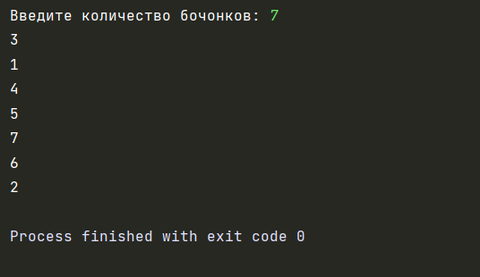
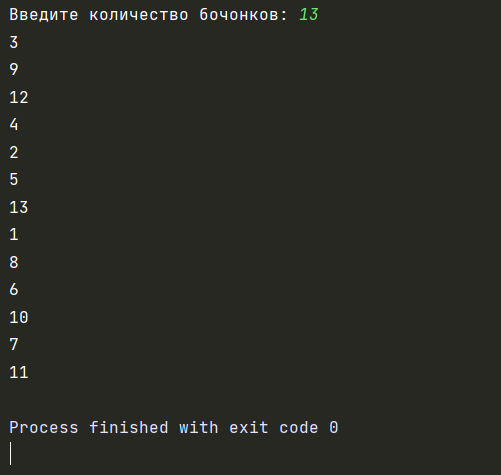
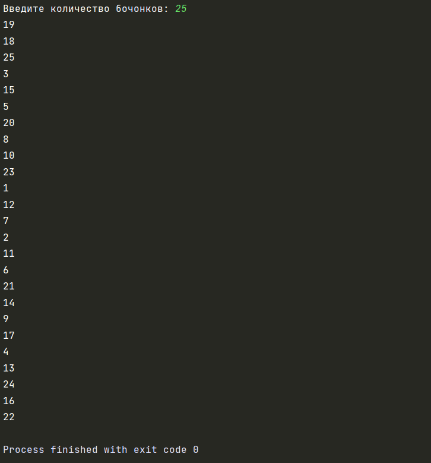

## Автор: 
Шляпникова Елена

## Задание:
 Написать программу для проведения жеребьевки методом генерации случайных чисел.  

В мешке с бочонками N бочек (от 1 до N). 

## Описание:
Программа выдает числа в случайном порядке в заданном диапазоне

## Тесты:

## Инструкция:

Для использования программы необходимо выполнить следующие действия:
1) Запустить программу
2) Ввести количество бочонков
3) Получить результат выполнения
